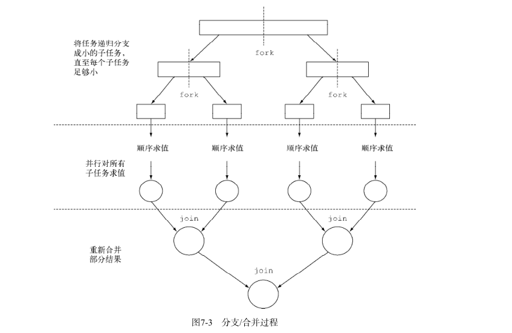
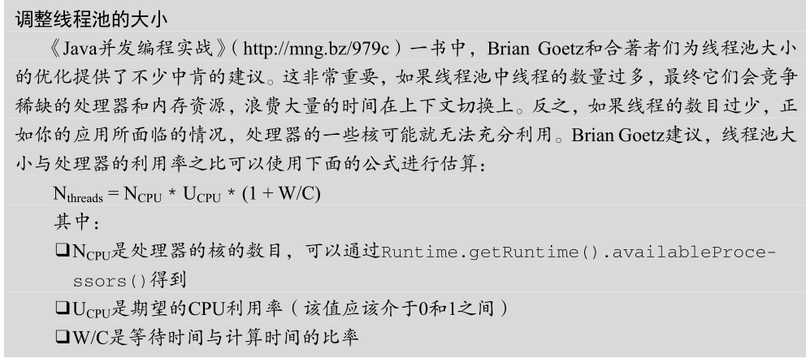

### jdk1.8学习总结
#### 1. 上集回顾

1. 函数式接口 lambda表达式 箭头函数

1. `Optional` 的使用 --> `OptionalTest`

3. default方法的提出原因

3. 流式操作的例子 -->`StreamTest`


### 2. 并行数据处理与性能
并行流就是一个把内容分成多个数据块，并用不同的线程分别处理每个数据块的流。这样一来，你就可以自动把给定操作的工作负荷
分配给多核处理器的所有内核，让它们都忙起来
1. 用并行流并行处理数据   
  只需要用parallelStream替换stream
  
2. 并行流的性能分析  
  例子： `ParallelStreamsTest`
3. 分支/合并框架- `ForkJoin`
    分支/合并框架的目的是以递归方式将可以并行的任务拆分成更小的任务，然后将每个子任
务的结果合并起来生成整体结果。  
  

它是 `ExecutorService` 接口的一个实现，它把子任务分配给线程池（称为 `ForkJoinPool` ）中的工作线程。

 要把任务提交到这个池，必须创建`RecursiveTask<R>` 的一个子类，其中 R 是并行化任务（以
及所有子任务）产生的结果类型，或者如果任务不返回结果，则是 `RecursiveAction` 类型（当
然它可能会更新其他非局部机构）。要定义RecursiveTask，只需实现它唯一的抽象方法`compute ` 

protected abstract R compute();

这个方法同时定义了将任务拆分成子任务的逻辑，以及无法再拆分或不方便再拆分时，生成
单个子任务结果的逻辑。正由于此，这个方法的实现类似于下面的伪代码：
```
if (任务足够小或不可分) {
顺序计算该任务
} else {
将任务分成两个子任务
递归调用本方法，拆分每个子任务，等待所有子任务完成
合并每个子任务的结果
}
```

例子：`ForkJoinSumCalculator`

默认线程数 `Runtime.getRuntime().availableProcessors()`

### 3. `CompletableFuture` ：组合式异步编程
#### `Future` 接口
`Future` 接口在Java 5中被引入，设计初衷是对将来某个时刻会发生的结果进行建模。它建模
了一种异步计算，返回一个执行运算结果的引用，当运算结束后，这个引用被返回给调用方。在
`Future` 中触发那些潜在耗时的操作把调用线程解放出来，让它能继续执行其他有价值的工作，
不再需要呆呆等待耗时的操作完成（洗衣房的例子或欠条）。
```
ExecutorService executor = Executors.newCachedThreadPool();
Future<Double> future = executor.submit(new Callable<Double>() {
public Double call() {
return doSomeLongComputation();
}});
doSomethingElse();
try {
Double result = future.get(1, TimeUnit.SECONDS);
} catch (ExecutionException ee) {
// 计算抛出一个异常
} catch (InterruptedException ie) {
// 当前线程在等待过程中被中断
} catch (TimeoutException te) {
// 在Future对象完成之前超过已过期
}
```
#### `CompletableFuture`继承了`Future` 思路一致 增加了方便流式操作的方法
原始的样子
```
//创建返回CompletableFuture的方法
public Future<Double> getPriceAsync(String product) {
CompletableFuture<Double> futurePrice = new CompletableFuture<>();
new Thread( () -> {
try {
//getPrice为一个耗时的方法
double price = getPrice(product);
futurePrice.complete(price);
} catch (Exception ex) {
futurePrice.completeExceptionally(ex);
}
}).start();
return futurePrice;
}
//调用的时候

Future<Double> price=getPriceAsync(product);
//另一个耗时操作 也可以写为异步的
Float discount=getDiscount(priduct);
Float realprice=price*discount;
```
####将两个CompletableFuture建立联系
1. thenCompose 方法允许你对两个异步操作进行流水线，第一个操作完成时，
将其结果作为参数传递给第二个操作。你可以创建两个CompletableFutures 对象，
对第一个 CompletableFuture 对象调用thenCompose ，并向其传递一个函数。当第一个CompletableFuture
 执行完毕后，它的结果将作为该函数的参数，这个函数的返回值是以第一个 CompletableFuture 的返回做输入计算出的第二个 CompletableFuture 对象
 2. thenCombine 方法，它接收名为 BiFunction 的第二参数，这个参数
定义了当两个 CompletableFuture 对象完成计算后，结果如何合并

真实使用场景
```
 CompletableFuture.supplyAsync(() -> getPrice(product))
             thenCombine(CompletableFuture.supplyAsync(() -> getDiscount(product)), (dis, price) -> dis*price）
            .thenCompose(CompletableFuture.supplyAsync(() ->doSomethingElse());
```

#### 实战
业务需求
1. 已经获取一个商品集合，集合中的商品对象包含部分属性（商品名、商品编码）
2. 需要调取接口获取商品原价，依赖商品编码
3. 需要调取接口获取折扣，依赖商品编码
4. 商品真实价格等于原价*商品折扣
4. 需要调取接口获取商品优惠券，优惠券依赖价格
例子:FutureTest

####  线程数计算公式
 
 当前应用99%的时间都在等待接口的响应，所以估算出的W/C比率为100。这意味着如果你
期望的CPU利用率是100%，你需要创建一个拥有400个线程的线程池。实际操作中，如果你创建
的线程数任务数目更多，反而是一种浪费，因为这样做之后，你线程池中的有些线程根本没
有机会被使用。出于这种考虑，我们建议你将执行器使用的线程数，与你需要执行数目适应，
这样每个任务都应该对应一个服务线程。不过，为了避免发生由于任务数目过
多导致服务器超负荷而崩溃，你还是需要设置一个上限，比如100个线程


